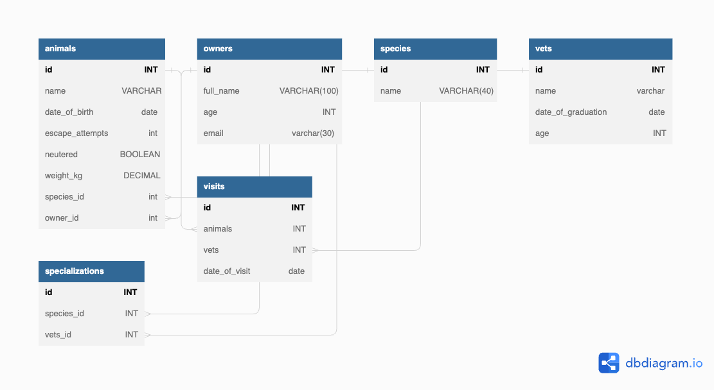

# vet--Clinic

<a name="readme-top"></a>

<!-- TABLE OF CONTENTS -->

# 📗 Table of Contents

- [📖 About the Project](#about-project)
  - [🛠 Built With](#built-with)
    - [Tech Stack](#tech-stack)
    - [Key Features](#key-features)
- [💻 Getting Started](#getting-started)
  - [Setup](#setup)
  - [Prerequisites](#prerequisites)
  - [Usage](#usage)
- [👥 Authors](#authors)
- [🔭 Future Features](#future-features)
- [🤝 Contributing](#contributing)
- [⭐️ Show your support](#support)
- [🙏 Acknowledgements](#acknowledgements)
- [📝 License](#license)

<!-- PROJECT DESCRIPTION -->

# 📖 vet clinic <a name="about-project"></a>

**vet clinic** is a relational database designed to manage and store information related to the operation of a veterinary clinic. User can use the project query to create, read, update and delete specific data from the database.

**Database Schema Diagram**


## 🛠 Built With <a name="built-with"></a>

### Tech Stack <a name="tech-stack"></a>

<details>
  <summary>Client</summary>
  <ul>
    <li><a href="https://sql.sh//">SQL</a></li>
  </ul>
</details>

<details>
<summary>Database</summary>
  <ul>
    <li><a href="https://www.postgresql.org/">PostgreSQL</a></li>
  </ul>
</details>

<!-- Features -->

### Key Features <a name="key-features"></a>

- **create animals table**
- **Add records to animal table**
- **query animal table**
- **aggregate operations**
- **use of transactions**

<p align="right">(<a href="#readme-top">back to top</a>)</p>

<!-- GETTING STARTED -->

## 💻 Getting Started <a name="getting-started"></a>

To get a local copy up and running, follow these steps.

### Prerequisites

In order to run this project you need:

1. git 
use the following link to setup `git` if you dont have it already installed on your computer 
<p align="left">(<a href="https://git-scm.com/book/en/v2/Getting-Started-Installing-Git">install git</a>)</p>

2. PostgreSQL
use the following link to setup `PostgreSQL` if you dont have it already installed on your computer 
<p align="left">(<a href="https://www.tutorialspoint.com/postgresql/postgresql_environment.htm">install PostgreSQL</a>)</p>


### Setup

Clone this repository to your desired folder:

```sh
  cd my-folder
  git clone git@github.com:Caren-Koroeny/vet--Clinic.git
```

### Usage
This repository includes files with plain SQL that can be used to run the project.

- Use [schema.sql](./schema.sql) to create all tables.
- Use [data.sql](./data.sql) to populate tables with sample data.
- Check [queries.sql](./queries.sql) for examples of queries that can be run on a newly created database.


<p align="right">(<a href="#readme-top">back to top</a>)</p>

<!-- AUTHORS -->

## 👥 Authors <a name="authors"></a>

👤 **CarenSiya**

- GitHub: [@carensiya ](https://github.com/Caren-Koroeny)
- Twitter: [@carensiya](https://twitter.com/home)
- LinkedIn: [@carensiya](www.linkedin.com/in/caren-siya-a89712180)

<p align="right">(<a href="#readme-top">back to top</a>)</p>

<!-- FUTURE FEATURES -->

## 🔭 Future Features <a name="future-features"></a>

- [ ] **Add more advanced queries**
- [ ] **Add database performance audit**

<p align="right">(<a href="#readme-top">back to top</a>)</p>

<!-- CONTRIBUTING -->

## 🤝 Contributing <a name="contributing"></a>

Contributions, issues, and feature requests are welcome!

Feel free to check the [issues page](../../issues/).

<p align="right">(<a href="#readme-top">back to top</a>)</p>

<!-- SUPPORT -->

## ⭐️ Show your support <a name="support"></a>

If you like this project, please don't forget to follow me and give it a star.

<p align="right">(<a href="#readme-top">back to top</a>)</p>

<!-- ACKNOWLEDGEMENTS -->

## 🙏 Acknowledgments <a name="acknowledgements"></a>

I would like to acknowledge and thank [Microverse](https://www.microverse.org/) for providing the template for this repository.

<p align="right">(<a href="#readme-top">back to top</a>)</p>

<!-- LICENSE -->

## 📝 License <a name="license"></a>

This project is [MIT](./LICENSE) licensed.

<p align="right">(<a href="#readme-top">back to top</a>)</p>